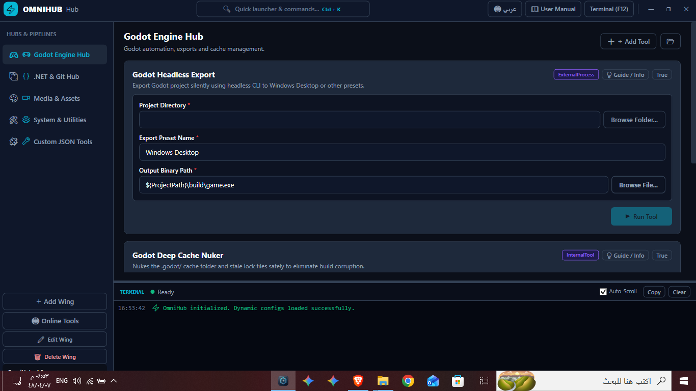

# OmniHub v1.0 ⚡

> **A modern, config-driven desktop automation workbench & game-development utility hub, built with .NET 8 and WPF.**

## Overview

OmniHub is an all-in-one developer workspace that eliminates repetitive CLI overhead. It consolidates everyday compilation, modding, media-asset preparation, and project-maintenance tasks into a single desktop app, with every tool defined by simple JSON configs instead of hardcoded logic.

<!-- [screenshot here] — replace the path above with a real screenshot of the main window before publishing -->

## Key Features

- ⚙️ **Config-driven architecture** — pipelines, tools, and categories are loaded dynamically from JSON, so new tools can be added without touching core code.
- 🧰 **50+ built-in automation tools** — .NET compilation, Git sync, media conversion (multi-size `.ico` generation, OGG encoding), and game-file management.
- ☁️ **Online tool catalog** — discover, preview, and install community automation add-ons directly inside the app.
- 🎨 **Windows 11 Fluent UI** — dark mode, live terminal output, bilingual Arabic/English localization, and a command palette (`Ctrl + K`).
- 📦 **Zero-dependency portable binary** — published as a self-contained single file, no separate .NET runtime install needed.
- ✅ **Unit-tested core** — key services (config loading, token interpolation, icon generation) are covered by an xUnit test suite.

## Tech Stack

- **Language & Framework:** C# / .NET 8 (WPF)
- **Architecture:** Clean Architecture, MVVM, Dependency Injection (Core / Engine / Tools / UI)
- **UI:** Custom Fluent-inspired XAML design system
- **Testing:** xUnit

## Quick Start

1. Download `OmniHub_v1.0.0_win-x64.zip` from the **Releases** section.
2. Extract the archive.
3. Run `OmniHub.UI.exe`.

Or build from source with `run.bat` / `dotnet run`.

## How to Use

1. Open OmniHub — the sidebar lists tool categories loaded from the `configs/` folder (.NET, Godot, media, system).
2. Pick a tool card, fill in its parameters (paths, options), and run it — output streams live in the built-in terminal.
3. Use `Ctrl + K` to search for any tool by name instead of browsing categories.
4. Check the **Online Catalog** tab to discover and install additional community tools without updating the app itself.

## Status

This is a personal project still under active development and testing. The core tools and config system work as described, but new tools and categories are still being added. Bug reports and suggestions are welcome — feel free to open an [Issue](../../issues).

## License

Distributed under the [MIT License](LICENSE).
